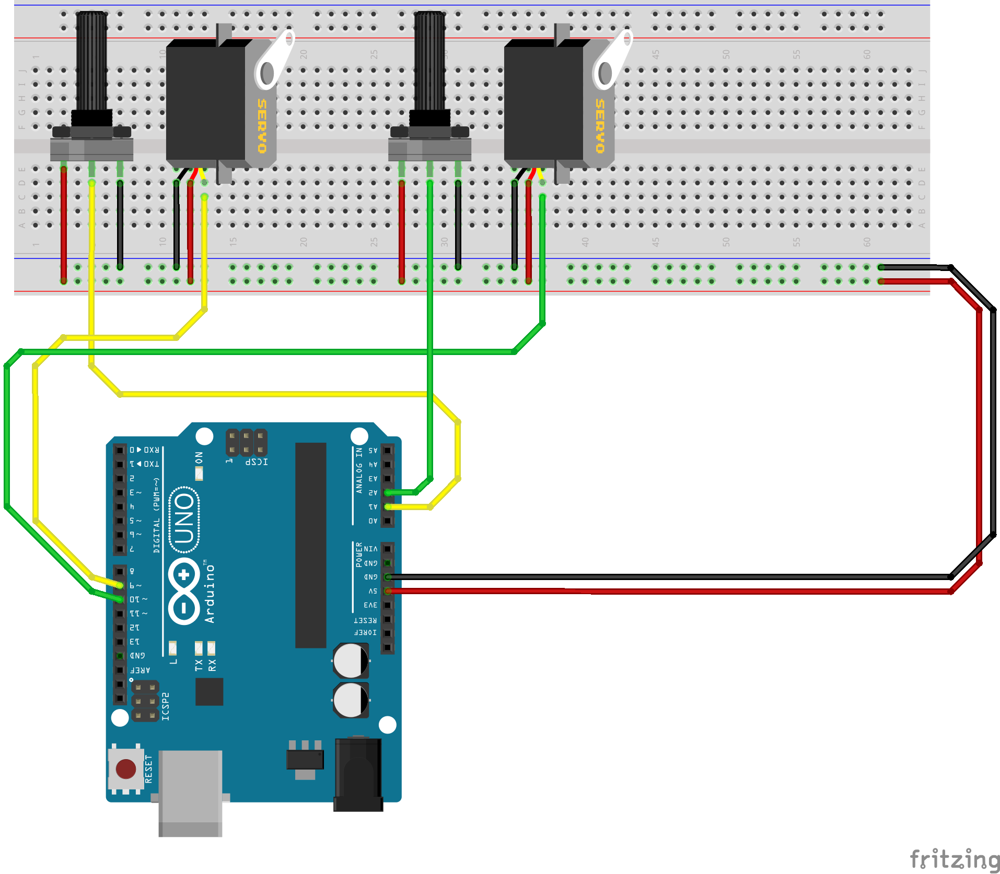
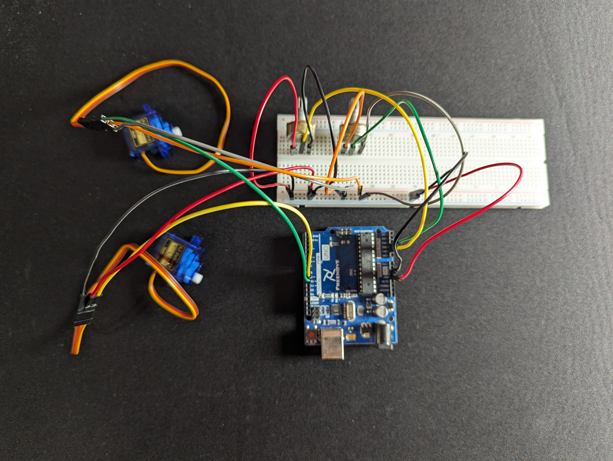
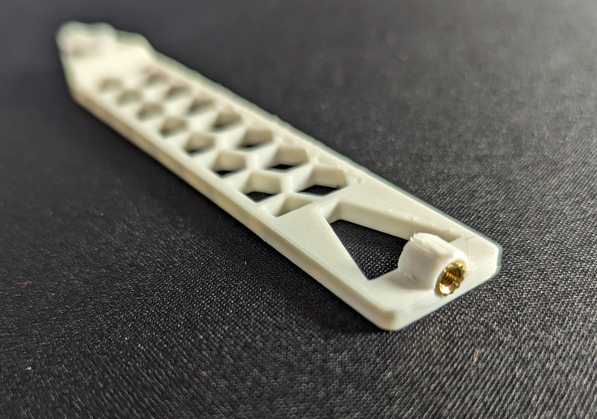
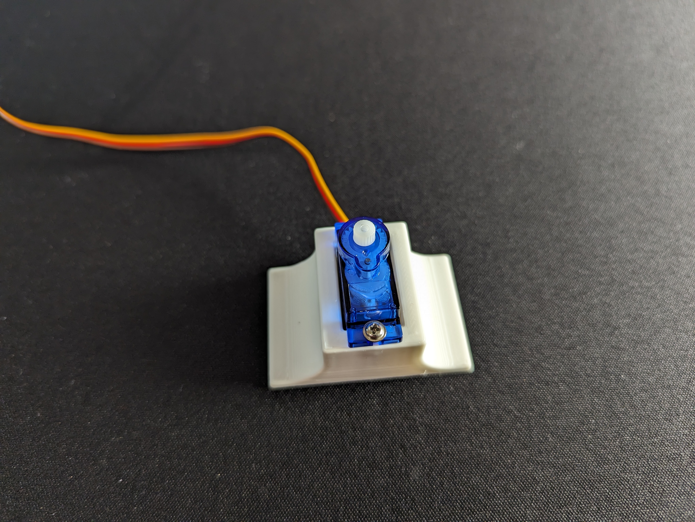

# Build instructions

Before you start with the project make sure that you have all the parts available.
- 1x Arduino Uno
- 2x 10kΩ potentiometers
- 2x SG90 micro servo motors
- Jumper wires
- Breadboard
- 1x M3x5 threaded insert
- M3 screw
- 4x small screws (usually part of the servo kit)

## Step 1
Print all parts provided in the folder [3d files](https://github.com/FckDisImAPanda/arduino-drawing-bot/tree/abad743cae6b6b02dc74ad093d1450224094405e/3d%20files).

_If you use other servos than SG90 please check if the parts will fit!_

## Step 2
Connect the potentiometers and servos according the wiring diaramm.

<table width="100%">
    <tr align="center">
        <td>Servo 1</td>
        <td>Servo 2</td>
        <td>Potentiometer 1</td>
        <td>Potentiometer 2</td>
    </tr>
    <tr>
        <td>
            <ul>
                <li>GND</li>
                <li>5V</li>
                <li>PIN D9</li>
            </ul>
        </td>
        <td>
            <ul>
                <li>GND</li>
                <li>5V</li>
                <li>PIN D10</li>
            </ul>
        <td>
            <ul>
                <li>5V</li>
                <li>PIN A1</li>
                <li>GND</li>
            </ul>
        </td>
        <td>
            <ul>
                <li>5V</li>
                <li>PIN A2</li>
                <li>GND</li>
            </ul>
        </td>
        </td>
    </tr>
</table>

## Step 3
Upload the code and test the hardware. When the potentiometer is turned, the associated servomotor should rotate.

In case of errors check the wiring and the connections again.

## Step 4
Screw the 3d printed parts to the servo control horns.
<table>
    <tr>
        <td></td>
        <td></td>
    </tr>
</table>

## Step 5
Insert the M4 threaded insert into the arm with the pen holder. Carefully heat the insert and push it into place. 

## Step 6
Screw the servo motors into the intended positions.

Stand: 

Arm: 

## Step 7
Turn both potentiometers as far counterclockwise as possible. Then put the servos together as shown in the picture. 

## Step 8
Insert the bold and a pen. 

## Step 9
Start drawing your beautiful pictures.
